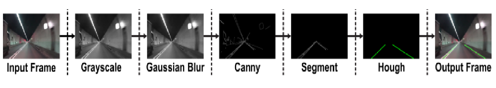

# Hough Transform (Lane Detection) Algorithm
In this study, we present a perception algorithm that is based purely on vision or camera data. We focus on demonstrating an end-to-end lane detection method using contemporary computer vision techniques for self-driving cars. We first present a basic approach based on edge detection and Hough transform which is the baseline approach for detecting only the straight lane lines.
We will study in detail, detecting lanes in images as any lane detection in videos, is done on individual frames i.e. individual images.

## Programming Language: 
Python

## Libraries: 
1) OpenCV
2) Numpy
3) Pyplot from Matplot Lib

## Explanation with step-by-step outputs on [BTech Blogs/Lane Detection]

### STEPS ARE:-
 
##### I.	Convert to Grayscale

##### II.	Reduction of noise

##### III.	Edge Detection

##### IV.	Region of Interest

##### V.	Detecting Straight Lines

##### VI.	Displaying the detected Lines

##### VII.	Averaging the Lines

##### VIII.	Displaying the Final Image

##### IX.	Lane Detection in Videos
    
##### X.	Conclusion

### For More Information
For some detailed explaination on each of the algorithm

a) Lane Detection - Hough Transform

b) Object Detection - You Look Only Once

Please visit our Blog Website

https://btechblogs.herokuapp.com/blog/lanedetection

https://btechblogs.herokuapp.com/blog/objectdetection

